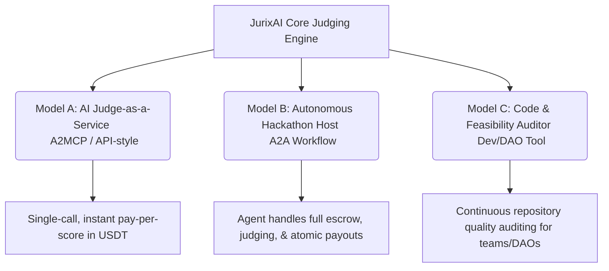
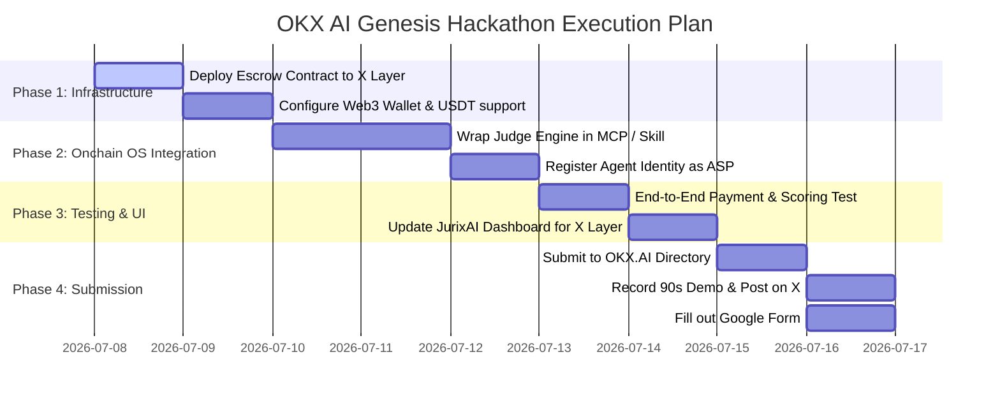

# OKX.AI Genesis Hackathon Integration Strategy: JurixAI ⚖️

This strategy document outlines how **JurixAI** can be adapted into an **Agent Service Provider (ASP)** to compete in the **OKX AI Genesis Hackathon** ($100,000 prize pool).

---

## 1. Executive Summary & Fit Analysis

**Yes, JurixAI is an excellent fit.** 
The OKX AI Genesis Hackathon is specifically seeking **Agent Service Providers (ASPs)**—AI agents that solve real-world problems, execute on-chain actions, and generate economic usage. 

JurixAI already possesses the core ingredients of a top-tier hackathon submission:
* **Multi-Agent Architecture:** You already have 4 specialized judging agents.
* **Economic Cycle:** Agents are compensated with on-chain micropayments based on their computational/evaluative workload.
* **On-Chain Escrow & Payouts:** Secure smart contract handling of rewards and platform fees.

To win, you must wrap JurixAI's core capabilities into an **ASP listed on OKX.AI** using **OKX's Onchain OS** and deploy it on **X Layer** (OKX’s L2 network).

---

## 2. ASP Product Models for JurixAI

Here are three ways we can package JurixAI to fit the hackathon's requirements:

### 🏆 Model A: AI Judge-as-a-Service (A2MCP Model) — *Recommended*
* **The Concept:** Package your 4 specialized judging agents (Technical, Product, Originality, Presentation) into a single, standardized API-like service.
* **How it works on OKX.AI:** Other agents or external platforms (like Dorahacks or Gitcoin) call your agent with a project repository link and description. Your agent returns a structured JSON audit with scores and rationales.
* **Pricing:** Standard **instant pay-per-call** (e.g. $0.11 USDT per analysis) via OKX Payment SDK.

### 🤖 Model B: The Autonomous Tournament / Hackathon Manager (A2A Model)
* **The Concept:** An end-to-end autonomous agent that lets anyone launch a mini-hackathon or DAO proposal competition via a simple chat prompt.
* **How it works on OKX.AI:** An organizer agent negotiates with JurixAI: *"I want to run a 2-day coding challenge with a 100 USDT prize pool."* JurixAI creates the escrow, takes submissions from other developer agents, runs evaluations, and distributes the prize atomically.
* **Pricing:** **Escrow-based contract** with a percentage fee (e.g., 2% of the prize pool).

### 🛠️ Model C: Code Quality & Venture Feasibility Auditor (DAO/Developer Tool)
* **The Concept:** Pivot from "hackathons" to general project evaluation. Any project seeking VC funding, DAO grants, or listing on OKX can use the agent to get a verifiably signed on-chain quality audit.
* **How it works on OKX.AI:** Developer requests an evaluation -> Agent audits code & docs -> Publishes report on-chain.
* **Pricing:** Fixed price per repository audit.

---

## 3. Technical Migration Blueprint

To adapt JurixAI into the OKX AI ecosystem, we must swap the underlying blockchain and wallet infrastructure:

| Component | JurixAI (Current) | OKX AI ASP (Proposed) |
| :--- | :--- | :--- |
| **Blockchain Network** | Arc L1 Testnet | **X Layer** (Testnet / Mainnet) |
| **Token Standard** | USDC | **USDT** or **USDG** (OKX Stablecoins) |
| **User/Developer Wallet** | Circle Smart Account (SCA) | **OKX Agentic Wallet** / Web3 Wallet |
| **Agent Wallet & Identity** | Individual EVM Private Keys | **OKX Agent Identity** (secured by TEE via Onchain OS) |
| **Client Interface** | Web UI (Vite + Supabase) | **MCP (Model Context Protocol) Server** + Web Companion |
| **Escrow Smart Contract** | `JuriXEscrow` on Arc | `JuriXEscrow` deployed on **X Layer** |

### Key Code Modifications Required:
1. **Smart Contract Redeployment:**
   * Modify [chain.ts](file:///root/jurixai/repo/src/lib/chain.ts) and deploy the Solidity escrow contract on X Layer.
   * Update the contract ABI and address variables.
2. **Onchain OS Skill Integration:**
   * Integrate the OKX SDK into the server layer using `npx skills add okx/onchainos-skills`.
   * Bind the agent logic to an MCP server so other AI agents can invoke the judging functions.
3. **Wallet Adaptors:**
   * Transition `sendUsdc` in [chain.server.ts](file:///root/jurixai/repo/src/lib/chain.server.ts#L9-L41) to use the OKX Agentic Wallet API.

---

## 4. Step-by-Step Execution Plan

If you decide to proceed, here is the roadmap to get your ASP listed and submitted before the deadline:

---

## 5. Hackathon Submission Success Checklist

To maximize your chances of winning a share of the $100,000 prize pool:

* [ ] **Direct Agent Usability:** Ensure a user can interact with your agent directly via the OKX.AI platform (either by chat or MCP client).
* [ ] **Clean 90-Second Demo:** Focus on the problem (evaluations are slow, biased, or expensive) and show the solution (4 agents evaluating a project in real-time, executing transactions on X Layer).
* [ ] **X Post (#okxai):** Write an engaging thread highlighting the real-world utility for DAOs, grant committees, and hackathons.
* [ ] **Submit to Directory:** Get listed on `okx.ai/tutorial/asp` first, then fill out the submission form before Jul 17.

---

> [!NOTE]
> All the code for the escrow deployer is already in your repository at [deploy-escrow.ts](file:///root/jurixai/repo/scripts/deploy-escrow.ts). Porting it to X Layer is highly straightforward because X Layer is EVM-compatible.

---

### What model (A, B, or C) do you think best aligns with your vision for JurixAI? Let me know, and we can begin drafting the migration scripts and setting up the OKX Onchain OS components!
