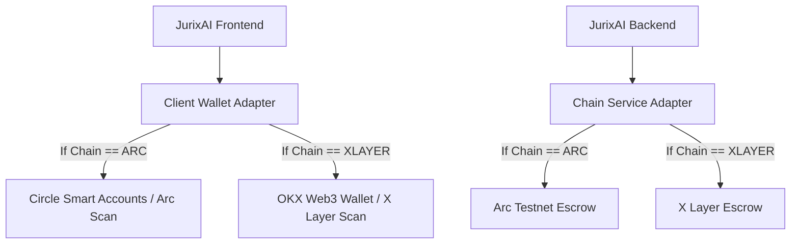

# OKX AI Integration Requirements & Co-Existence Plan ⚖️

This document outlines exactly what is needed from you to enable OKX support, and how we will implement it **without touching or breaking your existing Arc L1/Circle setup**.

---

## 1. Do we use OKX Agentic Wallet?
**Yes.** When JurixAI is listed on OKX.AI:
* **The Agent:** Will have its own **OKX Agentic Wallet** (powered by OKX Onchain OS). This wallet receives payments (in USDT/USDG) when other agents pay it to run evaluations.
* **The User (Organizer/Developer):** Can authenticate using their OKX wallet/identity to fund hackathons or withdraw prize pools on the **X Layer** network.

---

## 2. What is Needed From You (The Developer)?

To set up the OKX integration, you will need to acquire and configure the following credentials in your local environment (we will add these to your `.env` file):

### A. OKX API Credentials
1. Go to the [OKX Developer Portal](https://www.okx.com).
2. Generate an API Key with the following three fields:
   * `OKX_API_KEY`
   * `OKX_SECRET_KEY`
   * `OKX_PASSPHRASE`

### B. Gas Tokens for X Layer Testnet
* Because we will be deploying the `JuriXEscrow` smart contract to **X Layer**, we will need an EVM private key for deployment and testing.
* You will need some testnet **OKB** (the native gas token for X Layer) from the X Layer faucet to cover transaction fees.

---

## 3. Co-Existence Plan: Preserving Arc and Circle

To ensure we do not touch or break your existing Arc details, we will implement a **Multi-Chain Provider Architecture**. 

### How we will write the code:
1. **Dynamic Network Settings:** 
   In [chain.ts](file:///root/jurixai/repo/src/lib/chain.ts), instead of overriding values, we will define both networks and use an environment variable (e.g. `VITE_ACTIVE_CHAIN`) to decide which network is active, or allow the user to toggle it dynamically in the UI.
2. **Conditional Smart Contracts:**
   We will keep the current deployed Arc contract address (`0x89db74b925f694ebec1118cff9b08a1afe528785`) as-is. We will deploy a copy of the same escrow contract to X Layer and add it as a separate configuration.
3. **Modular Payouts:**
   In [judging.server.ts](file:///root/jurixai/repo/src/lib/jurix/judging.server.ts), the function `payAgentForEvaluation` will check which chain is being used and call either the Arc transfer helper (`sendUsdc`) or the OKX Agentic Wallet payment helper.

---

## 4. Immediate Next Steps

1. Get your **OKX API Keys** (Key, Secret, Passphrase) ready.
2. Get some testnet **OKB** for X Layer Testnet.
3. When you are ready to start building, let me know, and we will set up the dual-network config in the codebase!
